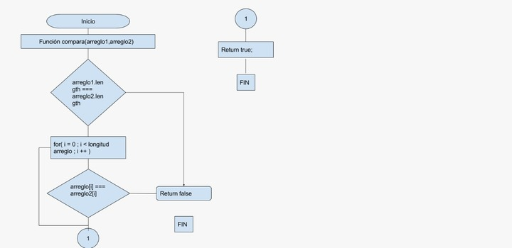

##Pseudocodigo
1.Crear una función que reciba 2 arreglos como parametro
2.Comprobar si la longitud de los arreglos es diferente.
  2.1 Si los arreglos no son iguales regresar falso
  2.2 Si tienen la misma longitud continuar con el proceso
3.Comprobar uno a uno los valores del arreglos.
  3.1 Si no son iguales rompemos el programa con un returm false.
  3.2 Si son iguales continuamos comparando uno a uno
4.Regresamos un true si los valores del arreglo son iguales
5.FIN

